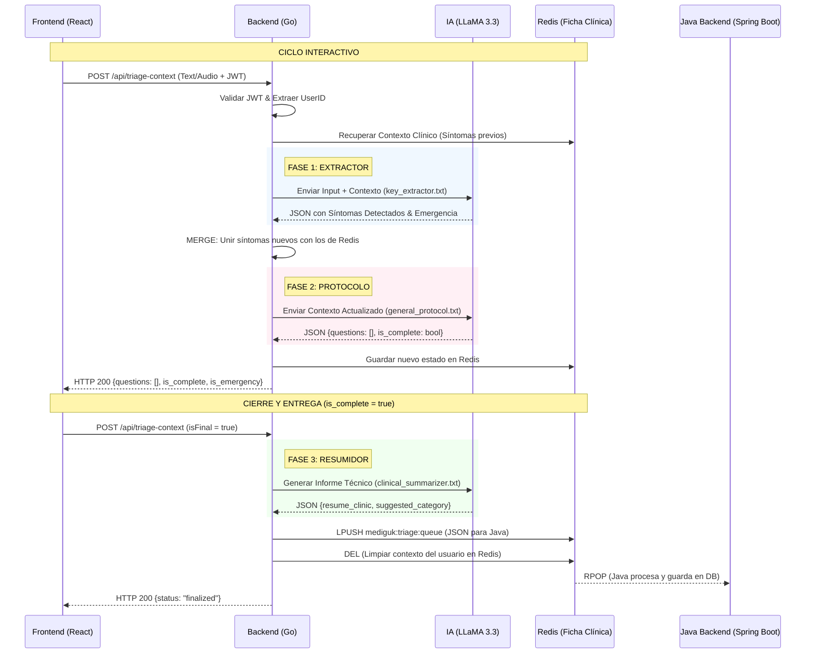

# Documentación Técnica: Patient Context Engine 🚀🩺

Esta arquitectura transforma el `context_engine` en un sistema multi-agente de alto rendimiento, optimizado para la precisión clínica y la agilidad conversacional.

---

## 🏗️ Resumen de la Arquitectura

El sistema se basa en un **Pipeline de 3 Fases** (los "3 Ninjas") que orquestan el triaje interactuando con una memoria persistente en Redis.

### Los 3 Ninjas (Prompts)

| Fase | Agente | Misión | Salida |
| :--- | :--- | :--- | :--- |
| **P1** | **Key Extractor** | Analizar el lenguaje natural y extraer entidades clínicas (Síntomas, Zona, Tiempo). | JSON (Symptoms + IsEmergency) |
| **P2** | **Protocol Agent** | Gestionar la conversación. Si falta info clave, genera preguntas; si no, cierra. | JSON (Questions Array + IsComplete) |
| **P3** | **Clinical Summarizer** | Escribir un reporte médico técnico una vez finalizado el triaje. | JSON (Summary + Category) |

---

## 🔄 Flujo de Datos (Arquitectura de Proceso)

---

## 🛠️ Detalle de los Procesos Clave

### 1. Gestión de Estado (Redis)
- Cada usuario tiene una **Ficha Clínica** única en Redis bajo su `userID`.
- La información se guarda de forma estructurada como una lista de `Symptoms`. Esto evita que la IA "olvide" lo que se dijo en el primer mensaje.

### 2. Detección de Emergencias (Fase 1)
- El **Key Extractor** analiza cada palabra. Si detecta signos de alarma (ej: dolor torácico, asfixia), marca `is_emergency: true`.
- Esto permite al Frontend mostrar alertas visuales e incluso un botón de llamada a emergencias al instante.

### 3. El Contrato de Ráfaga (Fase 2)
- El Backend envía un **Array de Preguntas** (`questions: []`).
- El Frontend (React) recibe este array y puede renderizar las preguntas como una lista, facilitando que el paciente las responda todas de golpe (vía texto o audio).

### 4. El Resumen Profesional (Fase 3)
- Cuando el triaje llega a su fin, el **Summarizer** actúa como un filtro médico. Traduce el lenguaje del paciente ("dolor de tripa") a terminología profesional ("epigastralgia") para que el médico reciba un reporte técnico impecable.

---

> [!IMPORTANT]
> **Seguridad JWT & Fingerprint**: Todo este proceso está blindado. El `userID` se extrae del JWT compartido con Spring Boot y se valida la huella digital (Fingerprint) en cada petición para evitar robos de sesión.

> [!TIP]
> **Extensibilidad**: Para añadir nuevas reglas clínicas, no necesitas tocar el código Go. Solo edita los archivos `.txt` en `internal/prompts/`.
