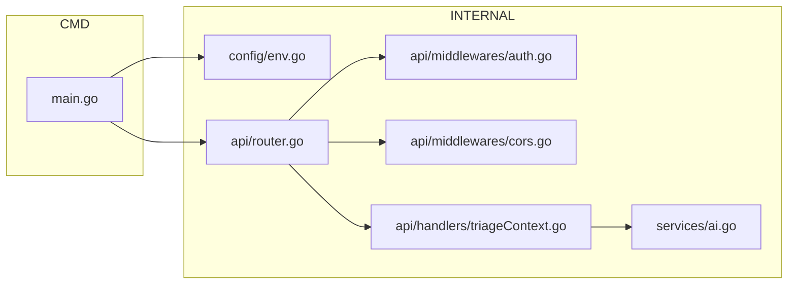

## 🛠️ Estructura del Proyecto

```mermaid
graph LR
    subgraph CMD
        A[main.go]
    end
    subgraph INTERNAL
        B[config/env.go]
        C[api/router.go]
        D[api/middlewares/auth.go]
        E[api/middlewares/cors.go]
        F[api/handlers/triageContext.go]
        G[services/ai.go]
    end

    A --> B
    A --> C
    C --> D
    C --> E
    C --> F
    F --> G
```