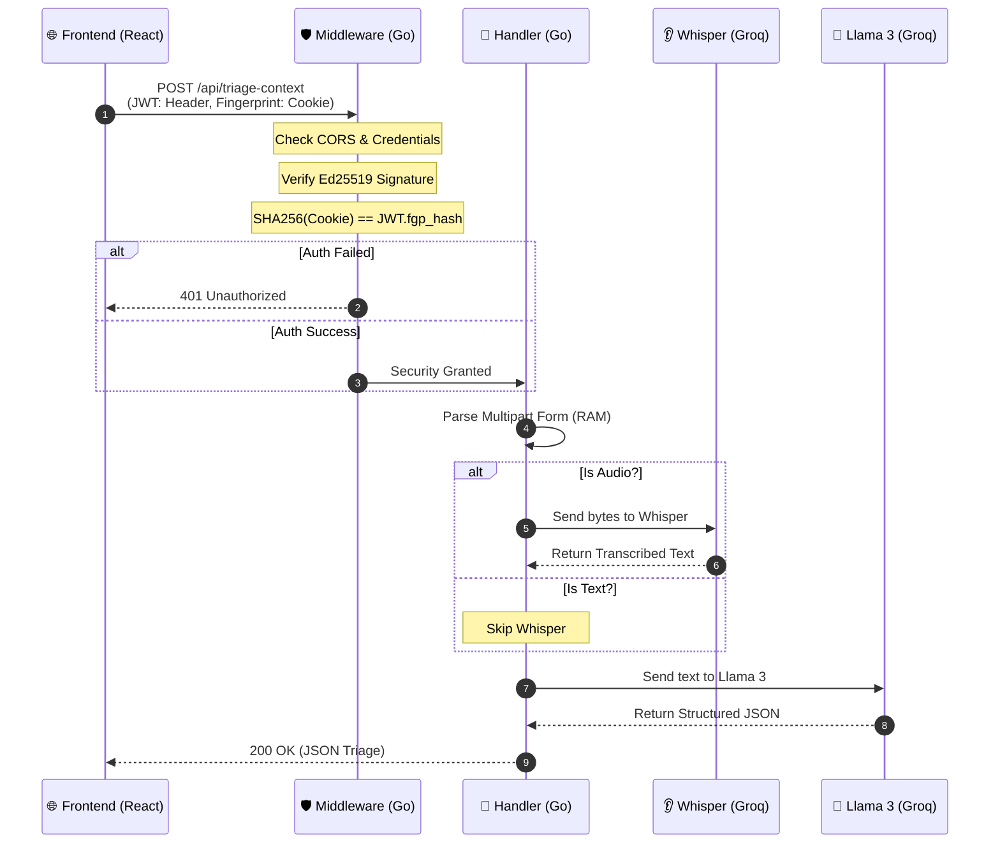

## 🔄 Flujo de Petición (Request Flow)

El siguiente diagrama muestra el viaje de una petición desde que el paciente pulsa "Enviar" en el frontend hasta que recibe el diagnóstico por IA.

```mermaid
sequenceDiagram
    autonumber
    participant C as 🌐 Frontend (React)
    participant M as 🛡️ Middleware (Go)
    participant H as 🏨 Handler (Go)
    participant W as 👂 Whisper (Groq)
    participant L as 🧠 Llama 3 (Groq)

    C->>M: POST /api/triage-context<br/>(JWT: Header, Fingerprint: Cookie)

    Note over M: Check CORS & Credentials
    Note over M: Verify Ed25519 Signature
    Note over M: SHA256(Cookie) == JWT.fgp_hash

    alt Auth Failed
        M-->>C: 401 Unauthorized
    else Auth Success
        M->>H: Security Granted
    end

    H->>H: Parse Multipart Form (RAM)

    alt Is Audio?
        H->>W: Send bytes to Whisper
        W-->>H: Return Transcribed Text
    else Is Text?
        Note over H: Skip Whisper
    end

    H->>L: Send text to Llama 3
    L-->>H: Return Structured JSON

    H-->>C: 200 OK (JSON Triage)
```
